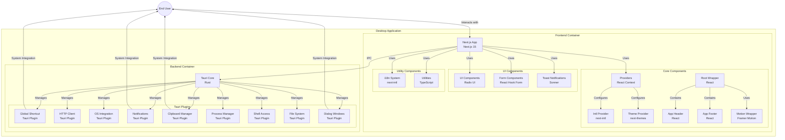

```mermaid
graph TB
    User((End User))

    subgraph "Desktop Application"
        subgraph "Frontend Container"
            NextApp["Next.js App<br>Next.js 15"]

            subgraph "Core Components"
                Providers["Providers<br>React Context"]
                RootWrapper["Root Wrapper<br>React"]
                IntlProvider["Intl Provider<br>next-intl"]
                ThemeProvider["Theme Provider<br>next-themes"]
                AppHeader["App Header<br>React"]
                AppFooter["App Footer<br>React"]
                MotionWrapper["Motion Wrapper<br>Framer Motion"]
            end

            subgraph "UI Components"
                RadixUI["UI Components<br>Radix UI"]
                Forms["Form Components<br>React Hook Form"]
                Toast["Toast Notifications<br>Sonner"]
            end

            subgraph "Utility Components"
                I18N["i18n System<br>next-intl"]
                Utils["Utilities<br>TypeScript"]
            end
        end

        subgraph "Backend Container"
            TauriCore["Tauri Core<br>Rust"]

            subgraph "Tauri Plugins"
                GlobalShortcut["Global Shortcut<br>Tauri Plugin"]
                HTTP["HTTP Client<br>Tauri Plugin"]
                OS["OS Integration<br>Tauri Plugin"]
                Notification["Notifications<br>Tauri Plugin"]
                Clipboard["Clipboard Manager<br>Tauri Plugin"]
                Process["Process Manager<br>Tauri Plugin"]
                Shell["Shell Access<br>Tauri Plugin"]
                FileSystem["File System<br>Tauri Plugin"]
                Dialog["Dialog Windows<br>Tauri Plugin"]
            end
        end
    end

    User -->|Interacts with| NextApp
    NextApp -->|Uses| Providers
    Providers -->|Configures| IntlProvider
    Providers -->|Configures| ThemeProvider
    RootWrapper -->|Contains| AppHeader
    RootWrapper -->|Contains| AppFooter
    RootWrapper -->|Uses| MotionWrapper
    NextApp -->|Uses| RadixUI
    NextApp -->|Uses| Forms
    NextApp -->|Uses| Toast
    NextApp -->|Uses| I18N
    NextApp -->|Uses| Utils

    NextApp -->|IPC| TauriCore
    TauriCore -->|Manages| GlobalShortcut
    TauriCore -->|Manages| HTTP
    TauriCore -->|Manages| OS
    TauriCore -->|Manages| Notification
    TauriCore -->|Manages| Clipboard
    TauriCore -->|Manages| Process
    TauriCore -->|Manages| Shell
    TauriCore -->|Manages| FileSystem
    TauriCore -->|Manages| Dialog

    GlobalShortcut -->|System Integration| User
    Notification -->|System Integration| User
    Clipboard -->|System Integration| User
    Dialog -->|System Integration| User
```
